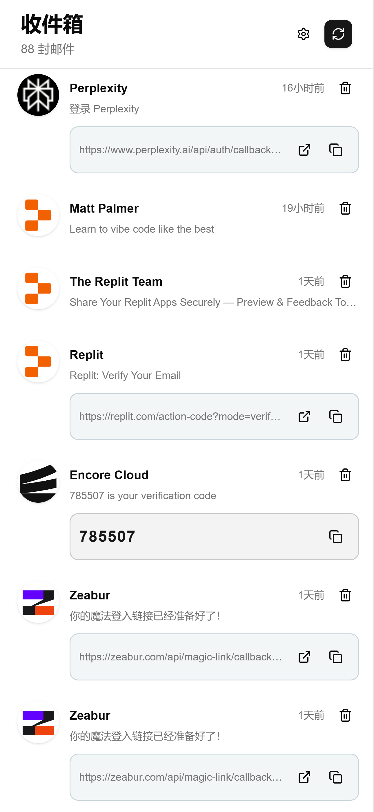
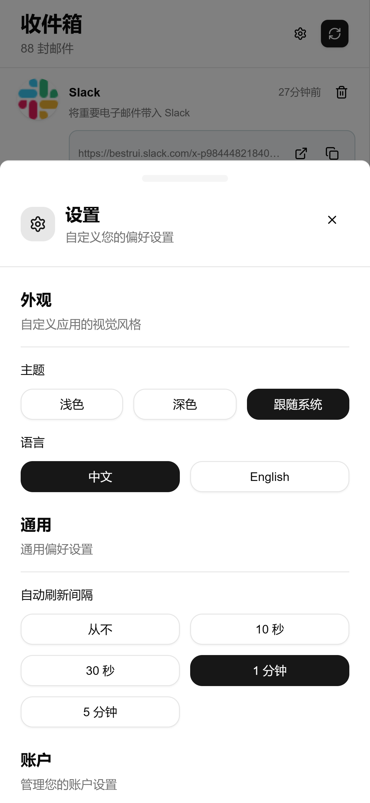

  

  <h1>Alle</h1>

  简体中文 | <a href="/README_en.md" style="margin-left: 5px">English</a>

---

## 🌟 项目简介

**Alle** 是一款专为个人用户打造的 **邮件聚合与管理平台**。  
通过整合各个邮箱服务商的 **邮件转发功能**，Alle 实现了跨账户邮件的 **集中接收与统一管理**，让用户无需频繁切换邮箱，也能随时掌握全部信息。  

以简洁的设计和智能识别为核心，Alle 让邮件管理更高效、更清晰、更安全。  

---

## 🖼️ 界面预览

### 桌面端

 

### 移动端
  |  |
| ---- | ---- |

---

## 🚀 核心功能特点

### 📬 邮件聚合

Alle 依托于各邮箱服务商的 **自动转发功能** 来实现聚合。  
用户只需在原邮箱中设置转发规则，将邮件自动发送到 Alle 平台提供的专属地址，  
即可在一个界面中查看所有邮箱的收件内容。  

> ✅ 支持 Gmail、Outlook、QQ 邮箱 等主流邮箱  
> ✅ 支持自定义域名邮箱的转发设置  
> ✅ 无需输入邮箱密码，安全可靠  

这种聚合方式避免了多平台登录的麻烦，也降低了安全风险，轻松实现「一处收全邮」。  

---

### 🤖 AI 识别

Alle 内置的 AI 引擎可对邮件内容进行分析，自动识别并提取关键信息。  

**识别内容包括：**  
- 🔐 **验证码**：自动识别并提取验证码内容，支持快速复制与使用。  
- 🔗 **链接识别与分类**：智能区分邮件中的不同类型链接：  
  - 📨 **验证链接**：用于注册、登录确认、身份验证等场景（如登录 GitHub、验证新设备）。  
  - ⚙️ **服务链接**：识别来自 GitHub、GitLab、Notion 等服务的通知类链接（如 commit、pull request、任务变更等）。  
  - 🚫 **订阅链接**：识别广告营销邮件中的退订或偏好管理链接，帮助用户快速清理无用订阅。  

AI 识别功能让邮件阅读更直观，用户可直接从提取结果中完成操作，大幅提升使用体验。  

---

### 📨 临时邮箱服务

借助 **Cloudflare Workers** 的域名邮箱功能，Alle 允许用户快速创建 **无限数量的临时邮箱地址**。  

这些临时邮箱可用于：  
- 🧾 注册网站或服务时接收验证码  
- 🕵️‍♂️ 保持主邮箱隐私安全  
- ⚡ 临时接收一次性信息或测试邮件  

所有临时邮箱接收的邮件均会自动汇入主界面，统一管理，避免遗漏。

### ✉️ 邮件发送功能

Alle 现在支持 **邮件发送功能**，用户可以通过配置的邮箱账户发送邮件。

**功能特性：**  
- 📧 **多账户支持**：可配置多个邮箱账户，支持 Gmail、Outlook、QQ 邮箱等主流服务商  
- 🔐 **安全认证**：使用 SMTP over HTTP 的安全方式发送邮件  
- 🎯 **智能配置**：自动检测邮箱提供商，预设常用服务器配置  
- 📱 **响应式界面**：提供美观的邮件撰写界面，支持桌面和移动端  
- 🎨 **现代化UI设计**：采用最新的响应式布局，优化小屏幕设备显示效果
- ⚙️ **完善的中文本地化**：支持完整的中文界面，包括设置窗口和添加账户对话框

**配置方式：**  
1. 在设置页面添加邮箱账户信息  
2. 配置 SMTP 服务器和端口（默认支持常见服务商）  
3. 在邮件界面直接撰写和发送邮件  

邮件发送功能与现有的邮件聚合功能完美结合，实现邮件的收发一体化管理。  

---

## 🛠️ 技术亮点

- 🌩️ **基于 Cloudflare Workers 构建**：  
  Alle 仅需一个域名即可部署，无需额外服务器或复杂环境配置，  
  充分利用边缘计算的高可用与低延迟特性。  

- ⚙️ **Next.js 架构**：  
  采用 **Next.js** 框架开发，拥有高性能渲染能力与良好的开发体验，  
  支持服务端渲染（SSR）与静态生成（SSG），确保页面加载快速、稳定。  

- 📱 **多平台自适应设计**：  
  使用响应式布局与 Tailwind CSS 样式体系，  
  为桌面端与移动端提供一致、流畅的交互体验。
  
- 🎯 **持续优化的用户体验**：  
  不断改进界面布局，优化小屏幕设备显示效果，  
  修复设置窗口关闭功能和添加账户对话框的布局问题。  

---

## 🔄 最近更新

### 🚀 最新功能改进

- **✅ 设置窗口优化**：添加了关闭按钮，修复了设置窗口无法关闭的问题
- **📱 响应式布局增强**：优化了小屏幕设备上的显示效果，特别是添加账户对话框
- **🌐 中文本地化完善**：修复了"hideAdvancedSettings"等翻译缺失问题
- **🎨 UI/UX 改进**：调整了表单间距、网格布局和标签对齐，提升用户体验

## 🧭 部署指南

Alle 的部署过程极为简洁，只需一个域名即可在 Cloudflare Workers 上运行。  
详细部署步骤请参考以下文档：  

👉 [📘 部署文档](docs/deploy.md)  

---

## 💡 愿景

Alle 致力于成为新一代的 **个人邮件中心**，通过智能聚合、AI 辅助与轻量部署，  
让用户以最小的成本享受高效、简洁、私密的邮件管理体验。  

---

  <b>📧 Alle —— 让邮件更聪明，更简单。</b>

